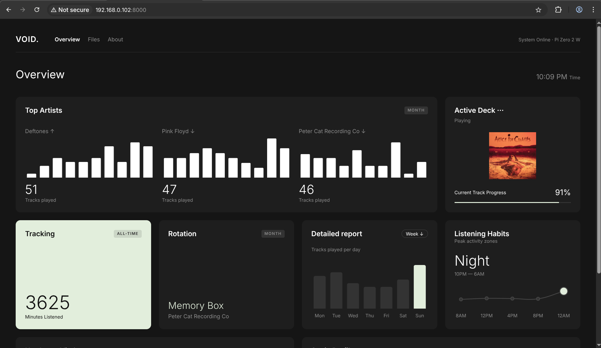

# Void Player (Beta)

> **Status: Beta Release**  
> Void Player is currently in its beta stage. While the core state-machine architecture, VLC playback engine, web dashboard, and headless integrations are stable, users may encounter edge cases depending on their specific hardware, rogue Bluetooth peripherals, or unsupported USB DACs. Bug reports and contributions are highly encouraged.

Void Player is a lightweight, high-performance headless audio engine designed specifically for the Raspberry Pi. Built entirely in Python, it bypasses standard desktop environments to deliver a pure, physical-button-driven music experience with a dynamic OLED interface, paired with a sleek, localized web dashboard for telemetry and hardware management.

At its core, Void Player utilizes a decoupled, non-blocking state-machine architecture. It handles hardware interrupts, dynamic audio routing, multithreaded display rendering, and SQLite telemetry without relying on standard `time.sleep()` UI loops, preventing thread starvation and ensuring a highly responsive tactile experience.

## Core Features

* **Local Web Dashboard & Hardware Sync:** A built-in FastAPI web server provides a sleek, bento-box style interface to control the physical hardware over your local network. Adjust boot volume, auto-play behavior, and OLED sleep timers, with changes syncing instantly to the hardware via internal JSON pipelines.
* **Granular Telemetry Engine:** A lightweight SQLite database tracks your top tracks, artists, genres, and listening habits locally. It calculates exactly how long you listen to a track versus skipping it. No cloud tracking, no subscriptions.
* **Decoupled State-Machine Architecture:** Uses a centralized event queue and an active button manager (`btn_mgr`) to safely bind and unbind GPIO interrupts across different menu states.
* **OLED Burn-In Protection:** Features a configurable sleep timer that actively monitors playback states. The screen gracefully blacks out when idle and features "Wake on Interaction" logic to prevent accidental skips when waking the display.
* **Headless Network & Power Management:** Includes a full physical power menu for safe reboots/shutdowns. The web dashboard also features a secure Wi-Fi configuration portal, allowing you to move the Pi to new networks without ever opening an SSH terminal.
* **VLC-Powered Playback Engine:** Supports FLAC, WAV, and MP3 formats with dynamic ID3 tag extraction via `tinytag`. Includes an isolated background thread for seamlessly wrapping long track titles and rendering playback states smoothly.

## Pictures
* **The Web Dashboard**: 
* **The file Transfer**:  *just drap and drop*
* **About Section**:  *the about section*


## Hardware Requirements

* **SBC:** Raspberry Pi (Zero 2 W, 3, or 4 recommended for optimal VLC and PipeWire performance)
* **Display:** 128x64 I2C OLED Display (e.g., SSD1306)
* **Input:** 6x Tactile Push Buttons
* **Audio Output:** USB DAC (recommended for high-fidelity output) or a paired Bluetooth device.

## Hardware Setup & Wiring

Void Player relies on the Raspberry Pi's internal pull-up resistors. Each tactile button must be wired directly between its designated GPIO pin and any available Ground (GND) pin on the Pi. No external pull-up or pull-down resistors are required.

### GPIO Button Configuration

* **Menu / Back:** GPIO 24
* **Center / Select:** GPIO 18
* **Next Track / Down:** GPIO 22
* **Previous Track / Up:** GPIO 27
* **Volume Up:** GPIO 17
* **Volume Down:** GPIO 23

### OLED Display (I2C)

The SSD1306 display connects via the standard hardware I2C pins:

* **VCC:** 3.3V (Pin 1)
* **GND:** Ground (Pin 6 or Pin 9)
* **SDA:** GPIO 2 (Pin 3)
* **SCL:** GPIO 3 (Pin 5)

## Software Dependencies

Void Player requires the standard Linux audio and Bluetooth stacks to function correctly, alongside the web backend utilities.

**System Packages:**
Ensure your Raspberry Pi has the following backend utilities installed:
```bash
sudo apt-get update
sudo apt-get install vlc pulseaudio-utils pulseaudio-module-bluetooth bluez
```

**Python Requirements:**
Install the necessary Python libraries using pip:
```bash
pip install -r requirements.txt
```

## Installation & Deployment

1. **Clone the repository:**
```bash
git clone https://github.com/kashbix/void-player.git
cd void-player
```

2. **Prepare the Music Directory:**
By default, the player scans for media in `/home/$USER/Music`. Ensure your FLAC, WAV, or MP3 files are placed in this directory, or upload them directly via the Web Dashboard.

3. **Configure Fonts (Optional):**
The UI uses `DejaVuSans-Bold.ttf` for crisp rendering. If this font is not available on your system, the `configs.py` file will automatically fall back to the default Pillow font.

4. **Run the Application:**
Start the core hardware engine and web dashboard by executing your main Python script(s):
```bash
python3 main.py
```
*Access the dashboard by navigating to `http://<YOUR_PI_IP>:8000` on any device connected to the same network. and if dont know how to acess the IP of your pi go to your router admin dashboard>network>DHCP Server>Client List or just to your pi setting using a monitor*

*Deployment Note: For a true headless appliance experience, it is highly recommended to configure your scripts to run as `systemd` background services on boot.*

## License

This project is open-source and available under the MIT License. See the LICENSE file for further details.
