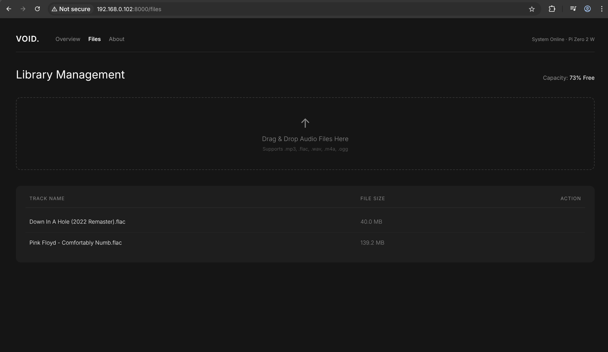
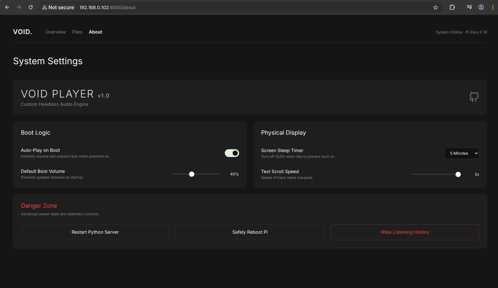

# Void Player (Beta)

> **Status: Beta Release** \> Void Player is currently in its beta stage. While the core state-machine architecture, VLC playback engine, web dashboard, and headless integrations are stable, users may encounter edge cases depending on their specific hardware, rogue Bluetooth peripherals, or unsupported USB DACs. Bug reports and contributions are highly encouraged.

Void Player is a lightweight, high-performance headless audio engine designed specifically for the Raspberry Pi. Built entirely in Python, it bypasses standard desktop environments to deliver a pure, physical-button-driven music experience with a dynamic OLED interface, paired with a sleek, localized web dashboard for telemetry and hardware management.

At its core, Void Player utilizes a decoupled, non-blocking state-machine architecture. It handles hardware interrupts, dynamic audio routing, multithreaded display rendering, and SQLite telemetry without relying on standard `time.sleep()` UI loops, preventing thread starvation and ensuring a highly responsive tactile experience.

## Core Features

* **Local Web Dashboard & Hardware Sync:** A built-in FastAPI web server provides a sleek, bento-box style interface to control the physical hardware over your local network. Adjust boot volume, auto-play behavior, and OLED sleep timers, with changes syncing instantly to the hardware via internal JSON pipelines.
* **Granular Telemetry Engine:** A lightweight SQLite database tracks your top tracks, artists, genres, and listening habits locally. It calculates exactly how long you listen to a track versus skipping it. No cloud tracking, no subscriptions.
* **Decoupled State-Machine Architecture:** Uses a centralized event queue and an active button manager (`btn_mgr`) to safely bind and unbind GPIO interrupts across different menu states.
* **OLED Burn-In Protection:** Features a configurable sleep timer that actively monitors playback states. The screen gracefully blacks out when idle and features "Wake on Interaction" logic to prevent accidental skips when waking the display.
* **Headless Network & Power Management:** Includes a full physical power menu for safe reboots/shutdowns. The web dashboard also features a secure Wi-Fi configuration portal, allowing you to move the Pi to new networks without ever opening an SSH terminal.
* **VLC-Powered Playback Engine:** Supports FLAC, WAV, and MP3 formats with dynamic ID3 tag extraction via `tinytag`. Includes an isolated background thread for seamlessly wrapping long track titles and rendering playback states smoothly.

## Gallery

### Software Interface

* **The Web Dashboard**:   
* **File Transfer**: Drag-and-drop your audio files directly to the Pi's local storage.   
* **Device Management**: Restart, reboot, configure network settings, and update player preferences. 

### Hardware Prototype

* **Current Setup**: Currently running on a breadboard. Future plans include a custom PCB and a 3D-printed enclosure. 
* **Main Menu**: The physical `luma.oled` interface.  
* **Now Playing**: Features smooth scrolling text for long track names so nothing is cut off.  

## Hardware Requirements

* **SBC:** Raspberry Pi (Zero 2 W, 3, or 4 recommended for optimal VLC and PipeWire performance)
* **Display:** 128x64 I2C OLED Display (e.g., SSD1306)
* **Input:** 6x Tactile Push Buttons
* **Audio Output:** USB DAC (recommended for high-fidelity output) or a paired Bluetooth device.

## Hardware Setup & Wiring

Void Player relies on the Raspberry Pi's internal pull-up resistors. Each tactile button must be wired directly between its designated GPIO pin and any available Ground (GND) pin on the Pi. No external pull-up or pull-down resistors are required.

### GPIO Button Configuration

* **Menu / Back:** GPIO 24
* **Center / Select:** GPIO 18
* **Next Track / Down:** GPIO 22
* **Previous Track / Up:** GPIO 27
* **Volume Up:** GPIO 17
* **Volume Down:** GPIO 23

### OLED Display (I2C)

The SSD1306 display connects via the standard hardware I2C pins:

* **VCC:** 3.3V (Pin 1)
* **GND:** Ground (Pin 6 or Pin 9)
* **SDA:** GPIO 2 (Pin 3)
* **SCL:** GPIO 3 (Pin 5)

## Installation & Deployment

**1. Install System Dependencies** Ensure your Raspberry Pi has the following Linux backend utilities installed:

```bash
sudo apt-get update
sudo apt-get install vlc pulseaudio-utils pulseaudio-module-bluetooth bluez

# pillow dependencies
sudo apt-get install libfreetype6-dev libjpeg-dev zlib1g-dev python3-lgpio liblgpio-dev swig gcc
```

**2. Clone the Repository**

```bash
git clone https://github.com/kashbix/void-player.git
cd void-player

````

**3. Setup Python Environment** Create a virtual environment and install the required Python libraries:

```bash
python3 -m venv --system-site-packages .venv
source .venv/bin/activate
pip install -r requirements.txt
````

**4. Prepare the Music Directory** By default, the player scans for media in `/home/$USER/Music`. Ensure your FLAC, WAV, or MP3 files are placed in this directory, or upload them directly via the Web Dashboard. *(Optional: The UI uses `DejaVuSans-Bold.ttf`. If unavailable, `configs.py` falls back to the default Pillow font).*

**5. enable i2c in raspi-config**

```bash
sudo raspi-config
```

Arrow down to `interface options > I2C > Enable`

reboot at the popup, or later if you're already planning on it

**6. Ensure your user is in the proper groups**

```bash
sudo usermod -a -G gpio,i2c $USER
```

**7. Run the Application** Start the core hardware engine and web dashboard by executing the main script:

```bash
python3 main.py
```

### Accessing the Dashboard

Navigate to `http://<YOUR_PI_IP>:8000` on any device connected to the same local network.

> **Note:** If you don't know your Raspberry Pi's IP address, you can find it by checking your router's admin dashboard (under Network \> DHCP Server \> Client List), looking at the physical OLED screen via the "File Share" menu, or by running `hostname -I` directly on the Pi using a monitor.

*Deployment Note: For a true headless appliance experience, it is highly recommended to configure your script to run as a `systemd` background service on boot.*

## PCB manufacturing

If you'd like to export the board manually from the KiCad project, you can follow the written guide for your overseas manufacturer of choice. In hardware/Void_Player/GRBRs/single.zip, there is a
pre-generated JLCPCB-compliant .zip file ready to be uploaded at [jlcpcb.com](https://cart.jlcpcb.com/quote?stencilLayer=2&stencilWidth=100&stencilLength=100&stencilCounts=5&plateType=1&spm=Jlcpcb.Homepage.1010)

## License

This project is open-source and available under the MIT License. See the LICENSE file for further details.
